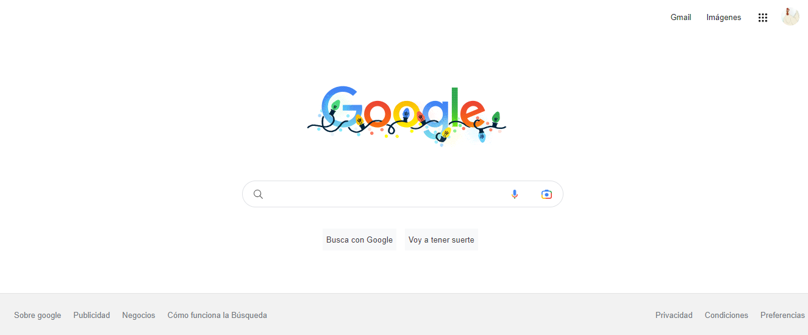

# Clon de google

Proyecto desarrollado en el bootcamp de Tecnolochicas PRO

## ¿Qué construí?
En este proyecto tuve como próposito construir la clonación de interfaz del navegador de Google.

Contiene los siguientes elementos
* Header
* Main
* Footer

## ¿Qué tecnologías utilice?
* HTML
* Css

## Mi objetivo
Aprender a utilizar los lenguajes y las etiquetas principales de CSS Y HTML.
